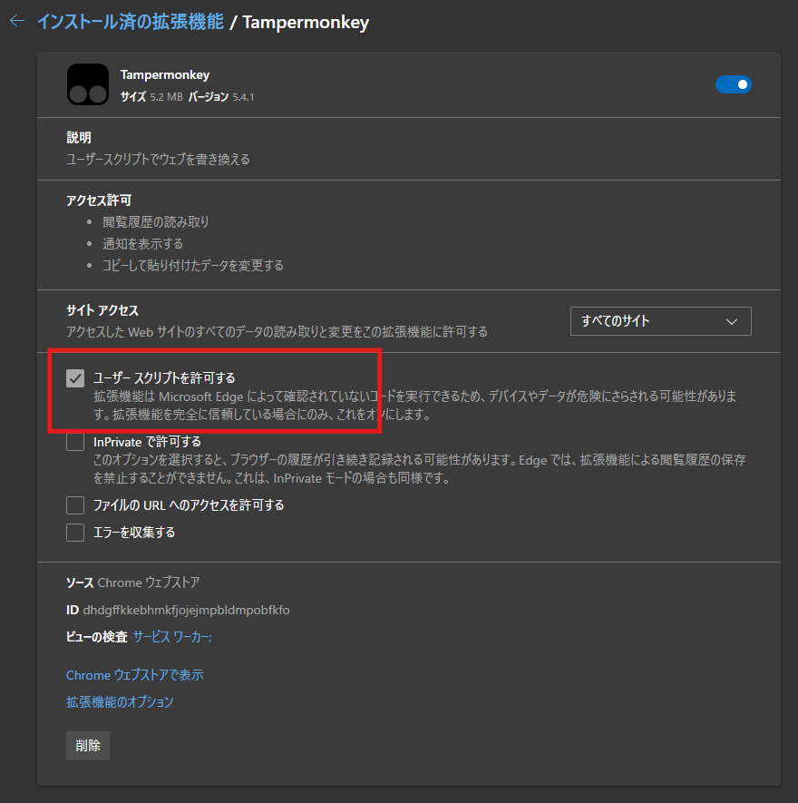
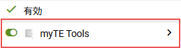
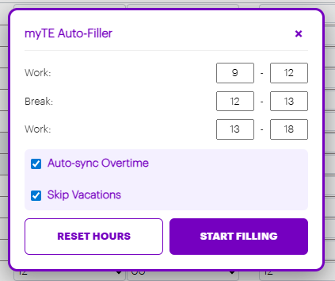
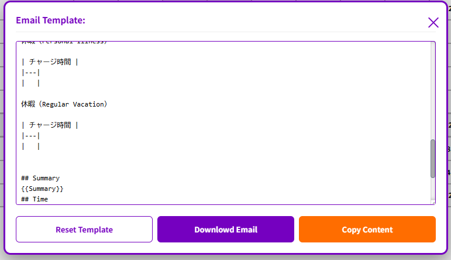

Languages: [English](../../README.md) | [日本語](./README.ja.md) | 简体中文

# myTE Tools (Tampermonkey)

`myTE Tools` 是面向 `https://myte.accenture.com/*` 的 Tampermonkey 用户脚本。

它在一个工具栏中整合了两项功能：

- Working Hours 自动填写（支持加班同步、假期跳过）
- EML 邮件生成（嵌入 Summary/Time/Expenses/Adjustments 截图）

## 功能

- 在 myTE 页头添加工具栏按钮
  - `⏰` 打开 Working Hours 对话框
  - `📧` 打开 Email Template 对话框
- 自动填写 Working Hours 的 Work/Break/Work 行
- 可选：从 Daily Overtime 行同步加班时长
- 可选：按配置的假期代码跳过日期
- 生成包含以下 4 个标签页截图的 `.eml`
  - Summary
  - Time
  - Expenses
  - Adjustments
- 通过 Tampermonkey 存储保存邮件模板

## 安装

1. 在浏览器安装 `Tampermonkey`。
2. 在扩展设置中确认开启：
   - Developer mode
   - Allow user scripts




3. 打开以下脚本地址：

```text
https://raw.githubusercontent.com/jerrywdlee/myTE-Tools/main/Tampermonkey/myte-tools.user.js
```

4. Tampermonkey 会打开安装页，点击 `Install`。
5. 在 Tampermonkey 中确认 `myTE Tools` 脚本已启用（ON）。



6. 刷新 myTE 并进入 Working Hours 页面。

## 使用方法

### Working Hours (`⏰`)

1. 点击工具栏 `⏰`


2. 按需调整（Work / Break / Work）行。



3. 按需勾选：
  - `Auto-sync Overtime`：自动同步并填入加班时长
  - `Skip Vacations`：对有请假/休假记录的日期不自动填写
4. 点击 `START FILLING`
5. 等待完成提示

### Email EML (`📧`)

1. 点击工具栏 `📧`


2. 按需编辑 YAML frontmatter + Markdown 模板



3. 点击 `Download Email`
4. 脚本会抓取 4 个标签页并下载 `.eml`

### Email 模板写法

邮件模板是一个遵循 Jekyll YAML front matter 的单一文档：

- YAML front matter（位于 `---` 与 `---` 之间）用于元数据
- Markdown 正文用于邮件内容

参考：

- [Front Matter | Jekyll • Simple, blog-aware, static sites](https://jekyllrb.com/docs/front-matter/)

示例：

```yaml
---
from: 'from@example.com'
to: 'to@example.com'
cc:
  - 'cc@example.com'
subject: '[myTE] Period {{period}} Approval Request'
---
```

```markdown
Dear Team,

## Summary
{{Summary}}
## Time
{{Time}}
## Expenses
{{Expenses}}
## Adjustments
{{Adjustments}}

regards,
```

支持的元数据键：

- `from`: 发件人地址
- `to`: 收件人地址
- `cc`: 抄送地址（数组或逗号分隔字符串）
- `subject`: 主题模板
- `displayName`: 用于兜底主题和文件名

主题变量：

- `{{period}}` 会被替换为当前期间，例如 `2026/04/15`

正文占位符：

- `{{Summary}}`、`{{Time}}`、`{{Expenses}}`、`{{Adjustments}}` 会在 HTML 邮件正文中替换为截图。

## 更新机制

如果通过上述 `raw.githubusercontent.com` 地址安装，Tampermonkey 可通过同一地址检查更新。

## 致谢

本项目受以下项目启发：

- [ballban/MyTE_Auto_Filler](https://github.com/ballban/MyTE_Auto_Filler)
- [souka-souka/myTE-Eml-Auto-Generator](https://github.com/souka-souka/myTE-Eml-Auto-Generator)
- [ava-innersource/myte-automate: This automate myTE Working Hours input](https://github.com/ava-innersource/myte-automate)
